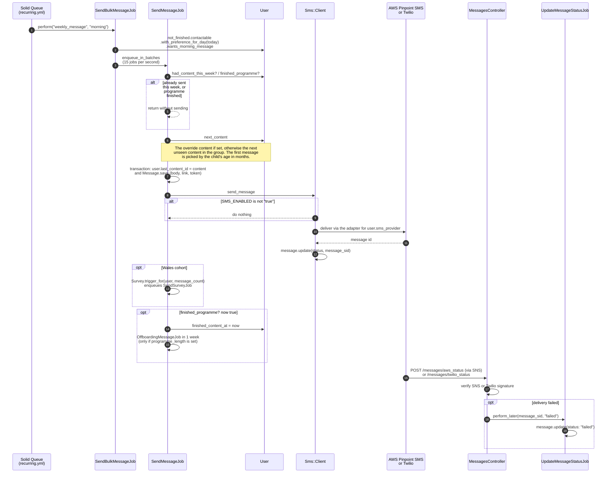
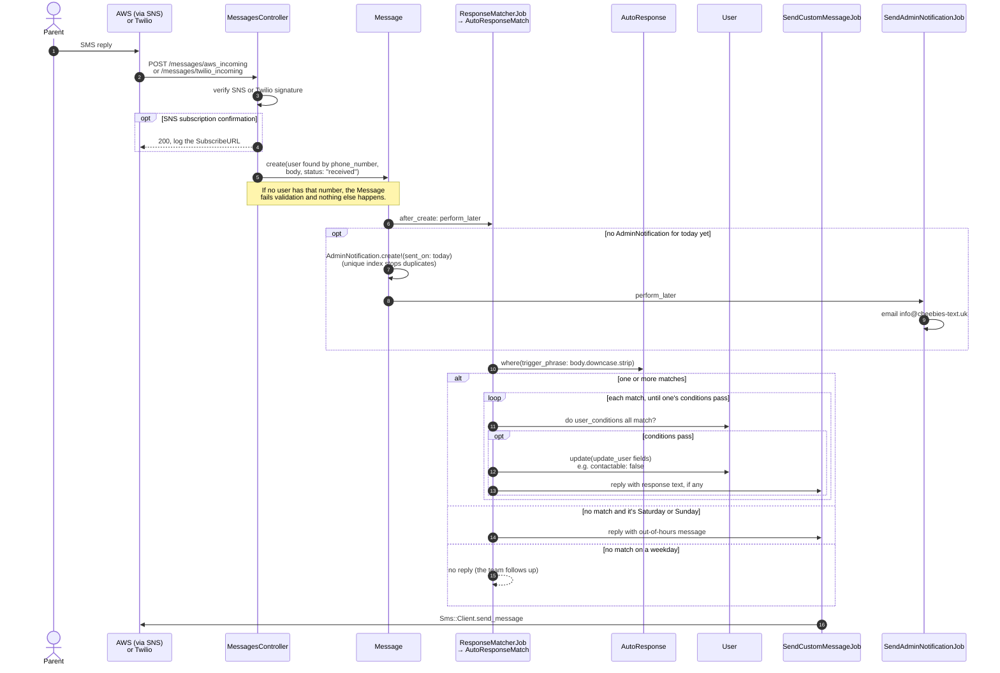
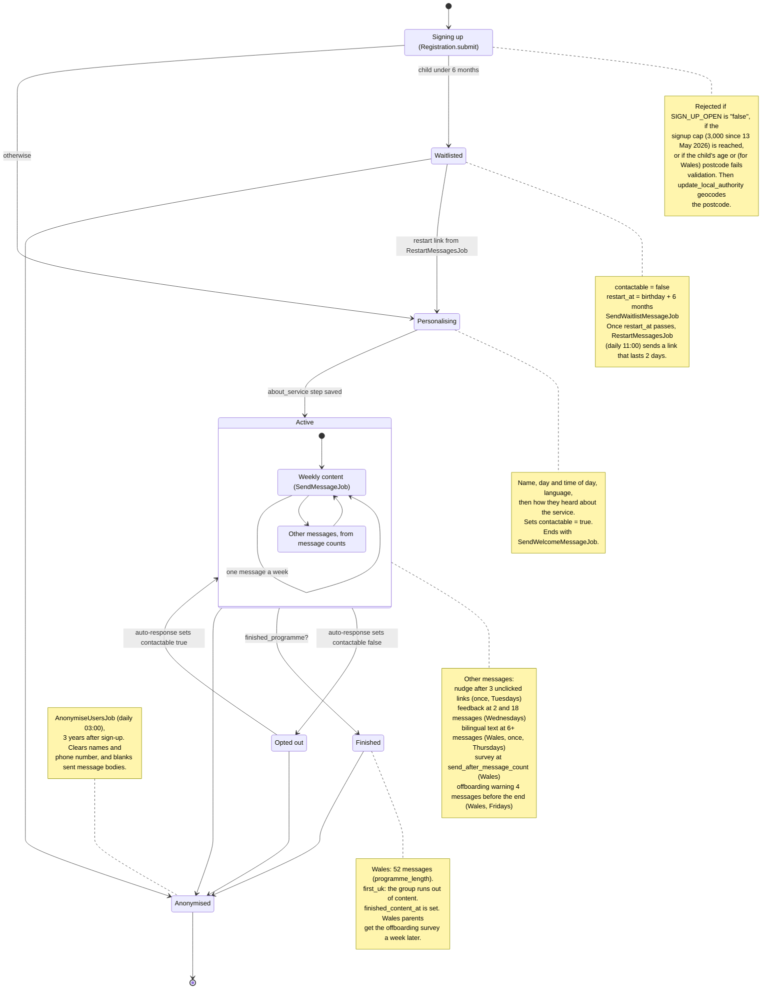

# Architecture

How the main flows in the app work, as diagrams. For the database tables, the
scheduled jobs calendar, the system context and the survey flow, open
[architecture.html](architecture.html) in a browser.

Class and method names match the code, so you can search for anything you see
here. If you change one of these flows, update the diagram in the same PR.

- [Weekly message pipeline](#weekly-message-pipeline)
- [Incoming SMS and auto-responses](#incoming-sms-and-auto-responses)
- [A parent's journey](#a-parents-journey)

## Weekly message pipeline

Each parent gets one piece of content a week, on the day and at the time of day
they chose. [config/recurring.yml](../config/recurring.yml) runs
`SendBulkMessageJob` four times a day: once for each time preference
(`morning`, `afternoon`, `evening`, `no_preference`). Each run only picks up
parents whose `day_preference` matches today.

What else to know:

- **Rate limit.** `Sms::Client::BATCH_SIZE` is 15. `EnqueuesJobsInBatches`
  delays each batch of 15 jobs by one more second, to stay under the AWS limit
  of 20 SMS a second.
- **Reruns are safe.** `SendMessageJob` skips anyone who got content in the
  last 6 days, so if `SendBulkMessageJob` fails and runs again, nobody gets two
  messages.
- **Retries.** `RetryFailedMessagesJob` runs every hour. It resends messages
  marked `failed` in the last hour, for parents who are still contactable and
  not anonymised.
- **Link clicks.** `{{link}}` in content becomes `/m/:token`. When a parent
  taps it, `MessagesController#next` sets `clicked_at` and redirects to the
  BBC page. Only `bbc.co.uk` links are allowed.
- **Other one-off messages** (welcome, waitlist, nudge, feedback, bilingual,
  survey, restart, offboarding, broadcasts) skip `SendBulkMessageJob` and
  `SendMessageJob`. They build a `Message` and call `Sms::Client`, usually
  through `SendCustomMessageJob`.

## Incoming SMS and auto-responses

When a parent texts back, the provider calls a webhook and the reply is saved
as a `Message` with `status: "received"`. Saving it triggers the auto-response
check and, at most once a day, an email to the team.

What else to know:

- **Auto-responses are data.** Admins edit them at `/admin/auto_responses`.
  `trigger_phrase` has to match the whole message, ignoring case and spaces at
  either end. `user_conditions` and `update_user` are JSON objects of `User`
  columns. `AutoResponse` checks the column names when it's saved.
- **Opting out and back in** works this way. An auto-response sets
  `contactable` to `false` or `true`. No other code in the app handles
  keywords like STOP, though the SMS providers may also act on them.

## A parent's journey

A parent's state isn't one column. It comes from `contactable`, `restart_at`,
`finished_content_at` and `anonymised_at` on `users`, plus how many content
messages they've had. This diagram shows how they change.

What else to know:

- **Cohorts.** `cohort` is `first_uk` or `wales`. Only Wales parents have a
  fixed `programme_length` (52), surveys, the bilingual text and offboarding.
  First UK parents keep getting content until their group runs out.
- **Links expire.** The sign-up `profile_token` lasts 15 minutes and the
  `restart_token` lasts 2 days. If a parent opens an expired link,
  `User.report_expired_token` reports it to AppSignal.
- **Admins can skip content.** Setting `next_content_override` on a user (from
  the admin user page) makes it their next message. Once it's sent,
  `last_content_id` points at it and normal ordering continues.
