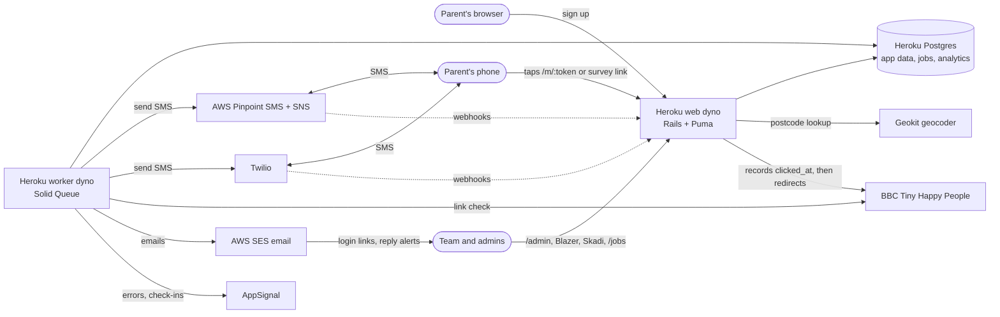
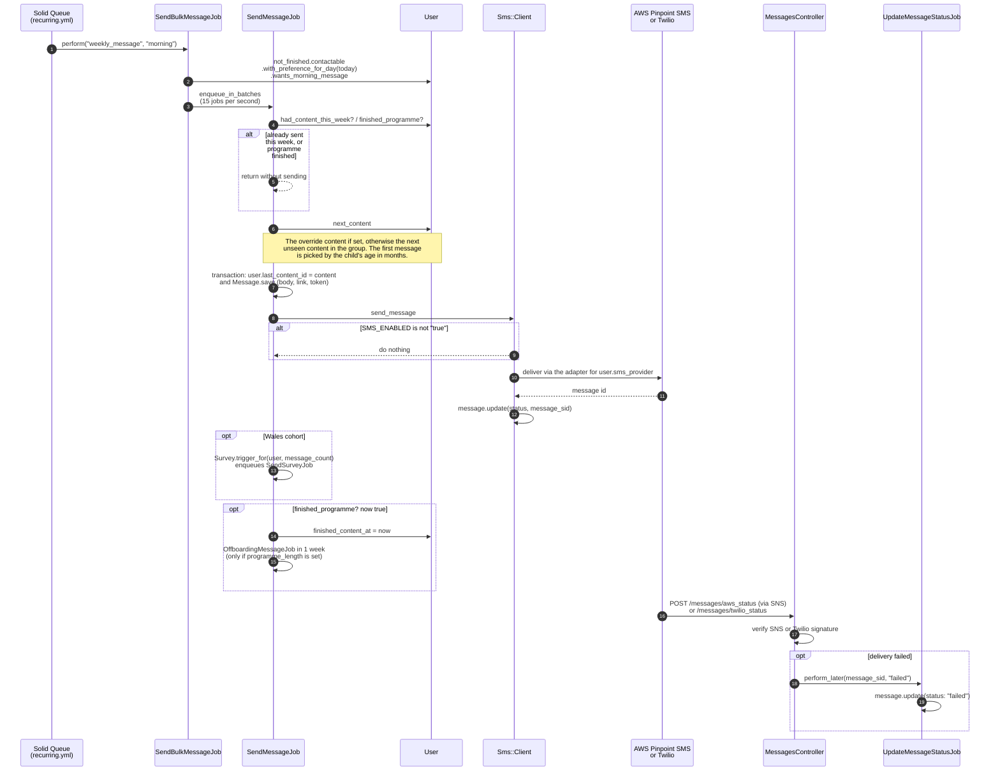
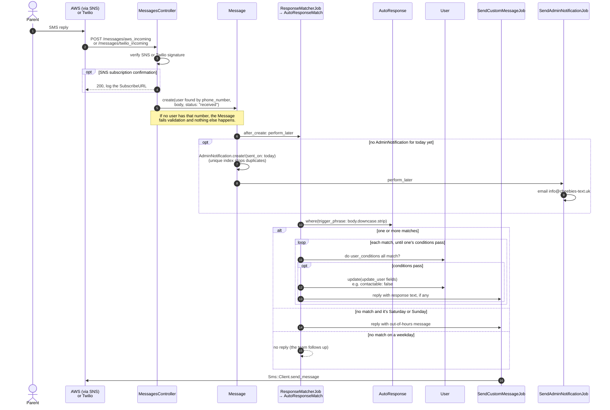
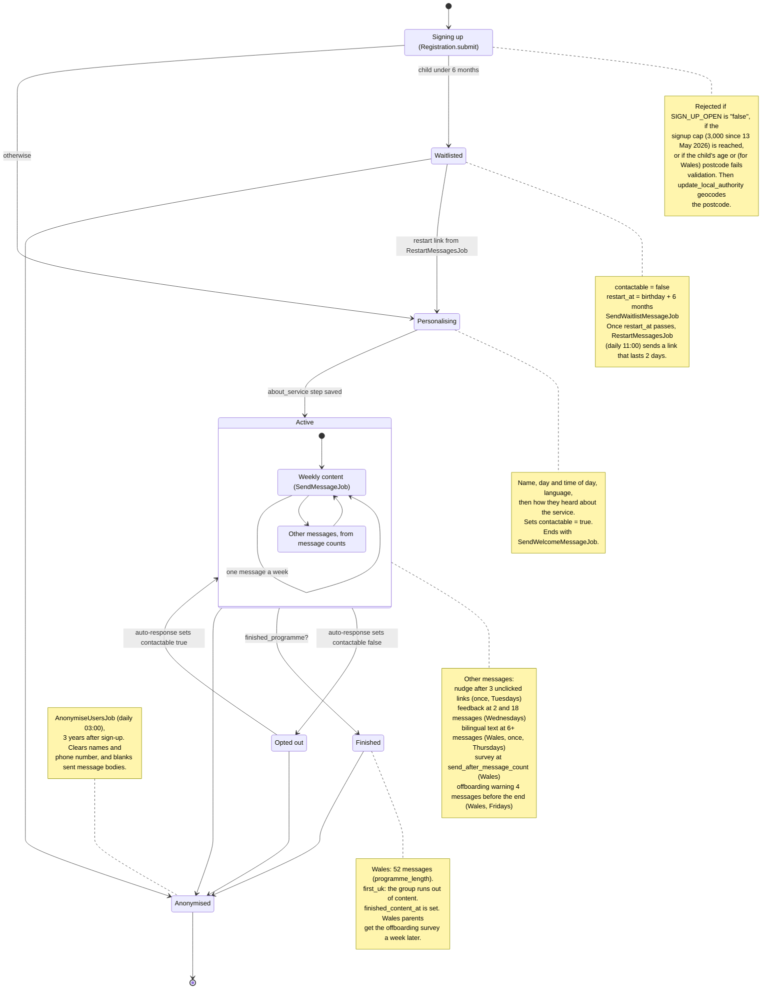
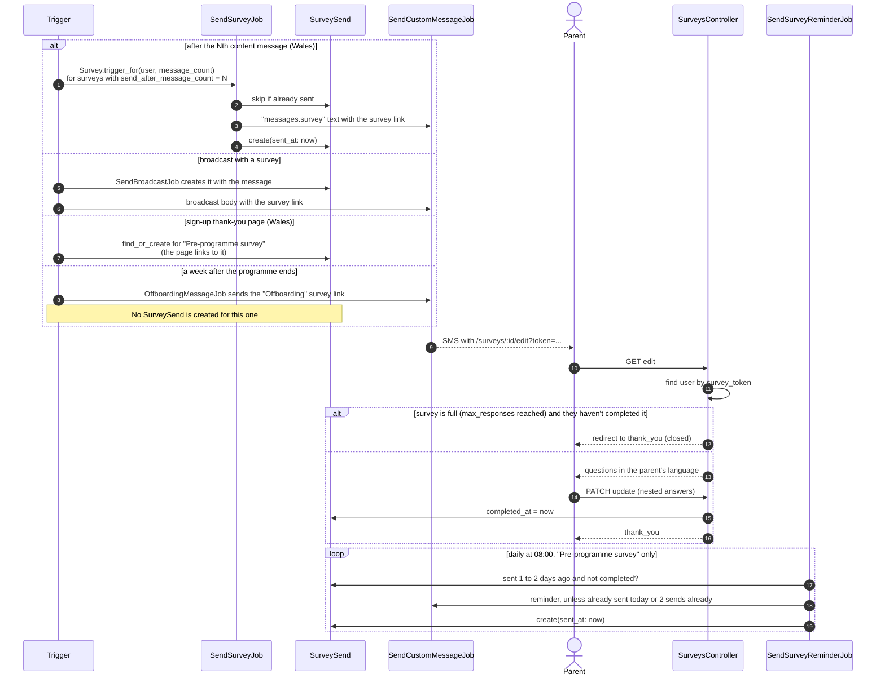
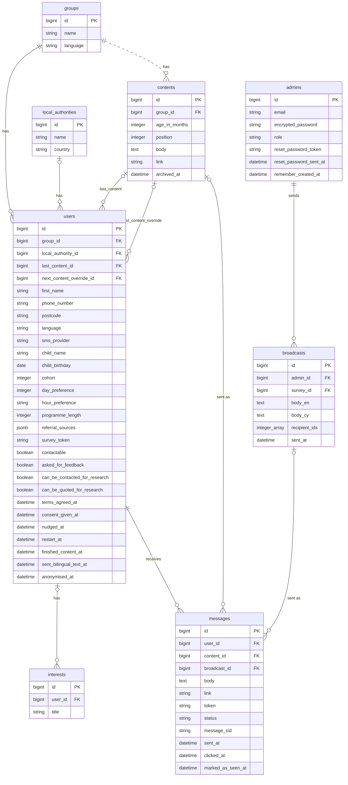
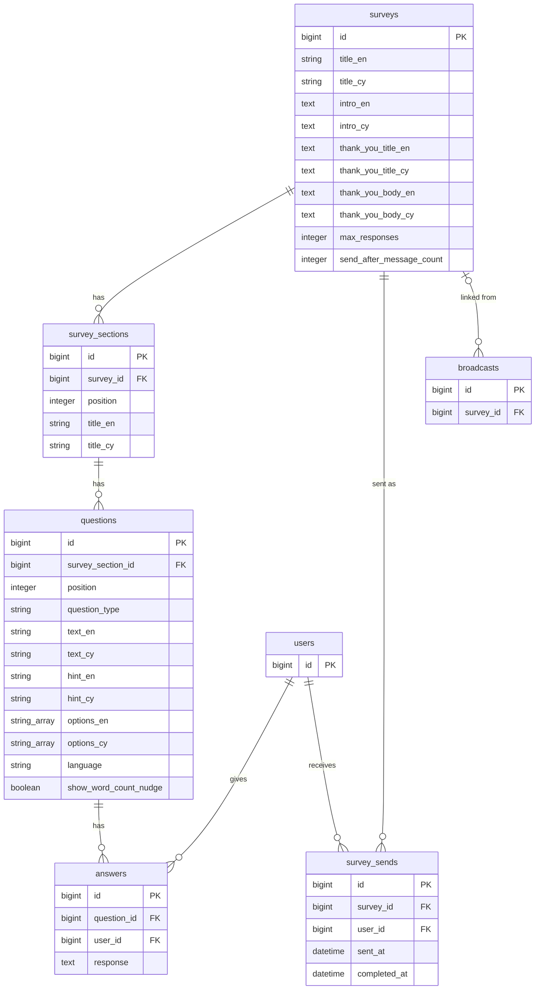
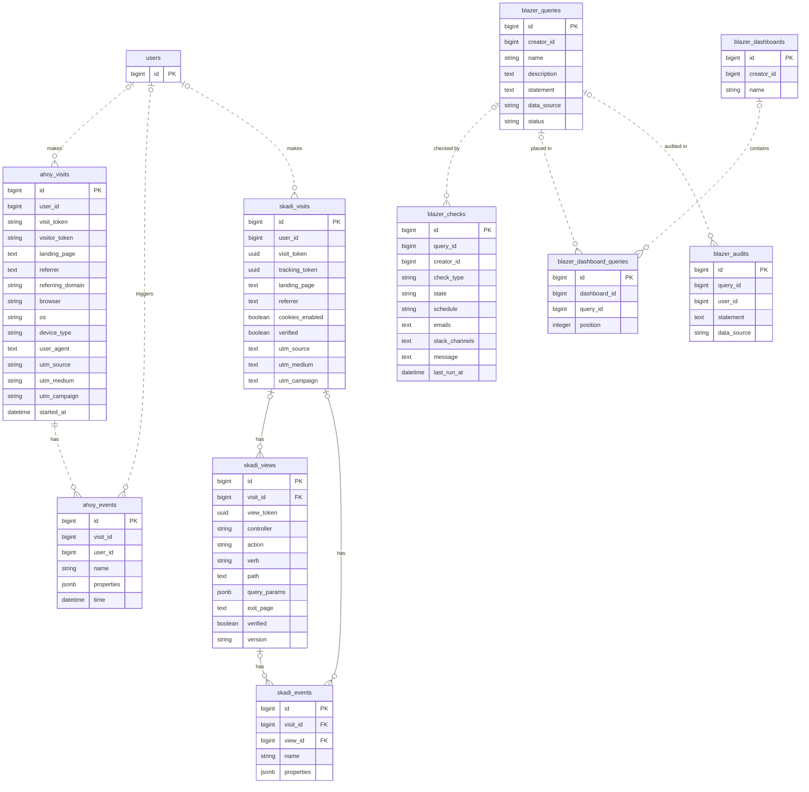

# Architecture

How the app is put together and how its main flows work, as diagrams. Class,
method and column names match the code, so you can search for anything you see
here. If you change the schema, one of these flows or
[config/recurring.yml](../config/recurring.yml), update this file in the same PR.

- [System context](#system-context)
- [Weekly message pipeline](#weekly-message-pipeline)
- [Incoming SMS and auto-responses](#incoming-sms-and-auto-responses)
- [A parent's journey](#a-parents-journey)
- [Survey flow](#survey-flow)
- [Scheduled jobs](#scheduled-jobs)
- [Database](#database)

## System context

The app runs on Heroku as a `web` dyno (Puma) and a `worker` dyno (Solid Queue),
both using one Postgres database. Solid Queue keeps its jobs in that same
database. All SMS goes out from background jobs. Delivery receipts and replies
come back to the web dyno as webhooks (dashed lines): AWS sends them through SNS
to `/messages/aws_*`, and Twilio posts to `/messages/twilio_*`.

- Every `users` row has an `sms_provider` (`aws` by default, or `twilio`).
  `Sms::Client` uses it to pick an adapter. Nothing is sent unless
  `SMS_ENABLED` is `"true"`.
- Content links in an SMS point at the app (`/m/:token`), not straight at the
  BBC. `MessagesController#next` sets the message's `clicked_at`, then
  redirects to the BBC page. Only `bbc.co.uk` links are allowed. Survey links
  in an SMS also open in the app.
- Webhooks are checked before they're used: the SNS message signature for AWS,
  and `X-Twilio-Signature` for Twilio.
- The `/admin` area, Blazer, Skadi and Mission Control (`/jobs`) are only for
  signed-in admins (Devise).

## Weekly message pipeline

Each parent gets one piece of content a week, on the day and at the time of day
they chose. [config/recurring.yml](../config/recurring.yml) runs
`SendBulkMessageJob` four times a day: once for each time preference
(`morning`, `afternoon`, `evening`, `no_preference`). Each run only picks up
parents whose `day_preference` matches today.

What else to know:

- **Rate limit.** `Sms::Client::BATCH_SIZE` is 15. `EnqueuesJobsInBatches`
  delays each batch of 15 jobs by one more second, to stay under the AWS limit
  of 20 SMS a second.
- **Reruns are safe.** `SendMessageJob` skips anyone who got content in the
  last 6 days, so if `SendBulkMessageJob` fails and runs again, nobody gets two
  messages.
- **Retries.** `RetryFailedMessagesJob` runs every hour. It resends messages
  marked `failed` in the last hour, for parents who are still contactable and
  not anonymised.
- **Link clicks.** `{{link}}` in content becomes `/m/:token`. When a parent
  taps it, `MessagesController#next` sets `clicked_at` and redirects to the
  BBC page. Only `bbc.co.uk` links are allowed.
- **Other one-off messages** (welcome, waitlist, nudge, feedback, bilingual,
  survey, restart, offboarding, broadcasts) skip `SendBulkMessageJob` and
  `SendMessageJob`. They build a `Message` and call `Sms::Client`, usually
  through `SendCustomMessageJob`.

## Incoming SMS and auto-responses

When a parent texts back, the provider calls a webhook and the reply is saved
as a `Message` with `status: "received"`. Saving it triggers the auto-response
check and, at most once a day, an email to the team.

What else to know:

- **Auto-responses are data.** Admins edit them at `/admin/auto_responses`.
  `trigger_phrase` has to match the whole message, ignoring case and spaces at
  either end. `user_conditions` and `update_user` are JSON objects of `User`
  columns. `AutoResponse` checks the column names when it's saved.
- **Opting out and back in** works this way. An auto-response sets
  `contactable` to `false` or `true`. No other code in the app handles
  keywords like STOP, though the SMS providers may also act on them.

## A parent's journey

A parent's state isn't one column. It comes from `contactable`, `restart_at`,
`finished_content_at` and `anonymised_at` on `users`, plus how many content
messages they've had. This diagram shows how they change.

What else to know:

- **Cohorts.** `cohort` is `first_uk` or `wales`. Only Wales parents have a
  fixed `programme_length` (52), surveys, the bilingual text and offboarding.
  First UK parents keep getting content until their group runs out.
- **Links expire.** The sign-up `profile_token` lasts 15 minutes and the
  `restart_token` lasts 2 days. If a parent opens an expired link,
  `User.report_expired_token` reports it to AppSignal.
- **Admins can skip content.** Setting `next_content_override` on a user (from
  the admin user page) makes it their next message. Once it's sent,
  `last_content_id` points at it and normal ordering continues.

## Survey flow

Surveys are mainly for the Wales cohort. A `survey_sends` row records that a
parent was sent a survey. Its `completed_at` is set when they submit. Survey
links use the parent's `survey_token`, a short code stored on `users`, so they
don't expire.

## Scheduled jobs

Everything in [config/recurring.yml](../config/recurring.yml). The weekly
message runs happen every day, but each one only messages parents whose
`day_preference` is today. Most of the other jobs pick their parents with a
`User` scope, then enqueue one job per parent through `SendBulkMessageJob`.

| Time  | Every day                                                  | One day a week                                    |
| ----- | ---------------------------------------------------------- | ------------------------------------------------- |
| :00   | Retry failed messages (every hour)                         |                                                   |
| 01:00 | Check BBC links                                            |                                                   |
| 02:00 | Clear finished jobs                                        |                                                   |
| 03:00 | Anonymise users who signed up 3 years ago                  |                                                   |
| 07:00 | Weekly message: morning                                    | Wed: feedback request. Thu: bilingual text (Wales) |
| 07:01 | Weekly message: no preference                              |                                                   |
| 08:00 | Survey reminders                                           |                                                   |
| 11:00 | Weekly message: afternoon. Restarts from the waitlist      | Tue: nudge. Fri: offboarding warning (Wales)      |
| 18:00 | Weekly message: evening                                    |                                                   |

- **Time zone.** Solid Queue reads these times in the server's time zone. On
  Heroku that's UTC unless the `TZ` config var is set, so in summer 07:00 would
  be 08:00 UK time. `config.time_zone` isn't set either, so `Time.zone.today`
  (used to choose the day's parents) is also UTC.
- **11:00 is the busiest slot.** The afternoon message, restarts, Tuesday
  nudges and Friday offboarding warnings all start then. They share the
  worker's 3 threads and the 15-a-second SMS batching.
- **Jobs that aren't scheduled** run when something happens. Welcome and
  waitlist messages run on sign-up. Surveys run after a set number of messages.
  The offboarding survey runs a week after the last message. Broadcasts run when
  an admin sends one. Auto-replies, admin emails and status updates run when a
  webhook arrives.

## Database

Every table in [db/schema.rb](../db/schema.rb), grouped by what it's for.
Timestamps (`created_at`, `updated_at`) are left out to keep the boxes short.
Solid lines are foreign key constraints in the database. Dashed lines are Rails
associations with no constraint. Array columns are shown as `string_array` and
`integer_array`.

### Messaging

Parents sign up as `users` and are put in a `group`. Each group has a sequence
of `contents` keyed by the child's age in months. Every SMS is a `message`,
either from the content programme or from an admin's `broadcast`.

Tables with no links: `auto_responses` (trigger_phrase, response,
user_conditions, update_user), `admin_notifications` (sent_on),
`research_study_users` (last_four_digits_phone_number, postcode),
`user_referrers` (gclid and UTM fields).

### Surveys

A `survey` is split into ordered `survey_sections` of `questions`, with English
and Welsh (`_cy`) text.

### Analytics

Ahoy tracks website visits and events. Skadi tracks page views, events and daily
demographic counts. Blazer stores saved SQL queries, dashboards and checks.

Tables with no links: `skadi_dashboards` (name, description, configuration),
`skadi_demographics` (name, value, uri, count, recorded_on).

### Rails and jobs

Tables owned by Rails and gems. Active Storage holds uploads, Action Text holds
the rich-text survey intros, and Solid Queue runs background jobs. Each job has
at most one row in each execution table, depending on its state. Polymorphic
links (`record_type` + `record_id`) can point at any table, so only the known
one, survey intros, is drawn.

```mermaid
erDiagram
  active_storage_blobs ||--o{ active_storage_attachments : "attached as"
  active_storage_blobs ||--o{ active_storage_variant_records : "has"
  surveys ||..o{ action_text_rich_texts : "intro_en, intro_cy"
  solid_queue_jobs ||--o| solid_queue_ready_executions : ""
  solid_queue_jobs ||--o| solid_queue_scheduled_executions : ""
  solid_queue_jobs ||--o| solid_queue_claimed_executions : ""
  solid_queue_jobs ||--o| solid_queue_blocked_executions : ""
  solid_queue_jobs ||--o| solid_queue_failed_executions : ""
  solid_queue_jobs ||--o| solid_queue_recurring_executions : ""
  solid_queue_processes |o..o{ solid_queue_claimed_executions : "claims"
  solid_queue_recurring_tasks |o..o{ solid_queue_recurring_executions : "task_key"

  active_storage_blobs {
    bigint id PK
    string key
    string filename
    string content_type
    bigint byte_size
    string checksum
    string service_name
    text metadata
  }
  active_storage_attachments {
    bigint id PK
    bigint blob_id FK
    string name
    string record_type
    bigint record_id
  }
  active_storage_variant_records {
    bigint id PK
    bigint blob_id FK
    string variation_digest
  }
  action_text_rich_texts {
    bigint id PK
    string name
    string record_type
    bigint record_id
    text body
  }
  surveys {
    bigint id PK
  }
  solid_queue_jobs {
    bigint id PK
    string active_job_id
    string class_name
    text arguments
    string queue_name
    integer priority
    string concurrency_key
    datetime scheduled_at
    datetime finished_at
  }
  solid_queue_ready_executions {
    bigint job_id FK
    string queue_name
    integer priority
  }
  solid_queue_scheduled_executions {
    bigint job_id FK
    string queue_name
    integer priority
    datetime scheduled_at
  }
  solid_queue_claimed_executions {
    bigint job_id FK
    bigint process_id
  }
  solid_queue_blocked_executions {
    bigint job_id FK
    string queue_name
    integer priority
    string concurrency_key
    datetime expires_at
  }
  solid_queue_failed_executions {
    bigint job_id FK
    text error
  }
  solid_queue_recurring_executions {
    bigint job_id FK
    string task_key
    datetime run_at
  }
  solid_queue_processes {
    bigint id PK
    string kind
    string name
    string hostname
    integer pid
    bigint supervisor_id
    datetime last_heartbeat_at
  }
  solid_queue_recurring_tasks {
    bigint id PK
    string key
    string schedule
    string class_name
    string command
    text arguments
    string queue_name
    boolean static
  }
```

Tables with no links: `solid_queue_pauses` (queue_name),
`solid_queue_semaphores` (key, value, expires_at).
